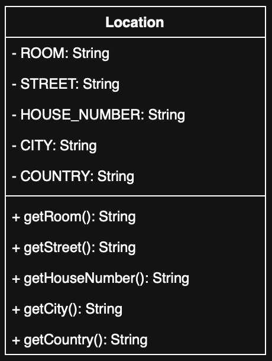

# Exercise: Working with Composite Objects – The `Location` Class

## 📘 English

### 📝 Task Description

In this exercise, you will work with **composite objects**. The class `SmartSpeaker` has been extended to include two location references:

- `manufacturerLocation` – where the device was produced (immutable)
- `installationLocation` – where the device is currently installed

You are given a class diagram of the `Location` class that represents these locations.

### 🧱 The `Location` Class

The `Location` class is described in the following UML diagram:

📝 Editable version: [`Location.drawio`](Location.drawio)

The class includes the following attributes, all of which are `final`:

- `ROOM`
- `STREET`
- `HOUSE_NUMBER`
- `CITY`
- `COUNTRY`

### 🔧 Your Task

- Implement the **final variables** as shown in the diagram.
- Create a **constructor** to initialize all attributes.
- Implement **getter methods** for all attributes (e.g., `getRoom()`, `getStreet()`, etc.).

Make sure your implementation matches the class structure shown in the diagram and uses proper naming and visibility (e.g., `private final` for attributes, `public` for methods).

---

### ✅ Solution

The implementation of the `Location` class can be found in the following file:

📄 [Location.java](./src/Location.java)

This file contains the complete solution including all final variables, constructor, and getter methods as specified in the UML class diagram.

---

## 📙 Deutsch

### 📝 Aufgabenbeschreibung

In dieser Aufgabe arbeitest du mit **zusammengesetzten Objekten**. Die Klasse `SmartSpeaker` wurde so erweitert, dass sie zwei Ortsangaben enthält:

- `manufacturerLocation` – der Herstellungsort (unveränderlich)
- `installationLocation` – der Installationsort (veränderbar)

Die Klasse `Location`, die diese Ortsinformationen kapselt, ist über ein UML-Diagramm beschrieben.

### 🧱 Die `Location`-Klasse

Die Klasse `Location` ist im folgenden Klassendiagramm dargestellt:

📝 Editierbare Version: [`Location.drawio`](Location.drawio)

Folgende Attribute sind in der Klasse enthalten und alle als `final` deklariert:

- `ROOM`  
- `STREET`  
- `HOUSE_NUMBER`  
- `CITY`  
- `COUNTRY`

### 🔧 Deine Aufgabe

- Implementiere die **finalen Variablen** entsprechend dem Klassendiagramm.
- Erstelle einen **Konstruktor**, der alle Attribute initialisiert.
- Implementiere **Getter-Methoden** für alle Attribute (z. B. `getRoom()`, `getStreet()`, usw.).

Achte darauf, dass deine Implementierung dem dargestellten Klassendiagramm entspricht und die Sichtbarkeiten korrekt gewählt sind (z. B. `private final` für Attribute, `public` für Methoden).

---

### ✅ Lösung

Die Umsetzung der `Location`-Klasse findest du in folgender Datei:

📄 [Location.java](./src/Location.java)

Diese Datei enthält die vollständige Lösung mit allen finalen Variablen, dem Konstruktor und den Getter-Methoden entsprechend dem UML-Klassendiagramm.
