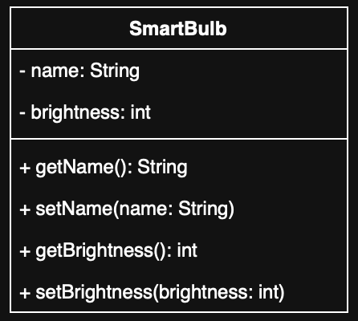

# Exercise: Class Diagram for a Smart Bulb

## 📘 English

### 📝 Task Description

Create a **class diagram** for a **smart light bulb**.

The smart bulb should have the following properties:

- A **name** (e.g. "Living Room Light")
- An **integer brightness level** (in percent)

Use the following data types:

- `String` for the name
- `int` for the brightness level

Each attribute of the class must:

- Be accessible via **getter methods**
- Be changeable via **setter methods**

Also consider the use of access modifiers:

- Use `private` for attributes  
- Use `public` for operations (getters/setters)

You can draw the class diagram:

- On paper **or**
- Use an online tool such as [https://app.diagrams.net](https://app.diagrams.net)

### 📦 Expected Structure

The class diagram should clearly show:

- Class name
- Attributes with visibility, name, and type
- Methods (getters and setters) with visibility, name, and type

---

### ✅ Solution

#### 📷 Diagram (PNG)

#### 🔧 Diagram Source (draw.io)
You can open the editable diagram using [https://app.diagrams.net](https://app.diagrams.net) and importing the following file:

- [`SmartBulb.drawio`](SmartBulb.drawio)

---

## 📙 Deutsch

### 📝 Aufgabenbeschreibung

Erstelle ein **Klassendiagramm** für ein **smartes Leuchtmittel**.

Das smarte Leuchtmittel soll folgende Eigenschaften besitzen:

- Einen **Namen** (z. B. „Wohnzimmerlampe“)
- Eine **ganzzahlige Helligkeit** (in Prozent)

Verwende folgende Datentypen:

- `String` für den Namen
- `int` für die Helligkeit

Jedes Attribut der Klasse soll:

- Über eine **Getter-Methode** abgerufen werden können
- Über eine **Setter-Methode** geändert werden können

Beachte auch die Zugriffsmodifizierer:

- `private` für Attribute  
- `public` für Methoden (Getter/Setter)

Das Klassendiagramm kannst du entweder:

- Per Hand zeichnen **oder**
- Mit einem Online-Tool wie [https://app.diagrams.net](https://app.diagrams.net) erstellen

### 📦 Erwartete Struktur

Das Klassendiagramm soll deutlich enthalten:

- Den Klassennamen
- Die Attribute mit Sichtbarkeit, Namen und Datentyp
- Die Methoden (Getter und Setter) mit Sichtbarkeit, Namen und Rückgabetyp

---

### ✅ Lösung

#### 📷 Diagramm (PNG)

#### 🔧 Diagrammquelle (draw.io)
Die editierbare Version des Diagramms kann in [https://app.diagrams.net](https://app.diagrams.net) geöffnet werden. Verwende dazu die folgende Datei:

- [`SmartBulb.drawio`](SmartBulb.drawio)

